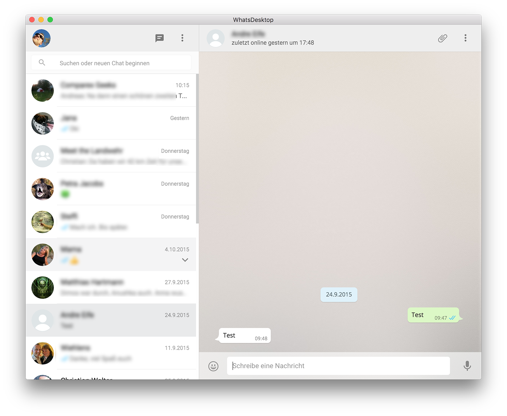

# &nbsp;Kanban Desktop

> Unofficial Kanban Desktop app

*Heavily inspired and adapted from [Caprine](https://github.com/sindresorhus/caprine) by [Sindre Sorhus](https://github.com/sindresorhus).*

*<strong>Note:</strong> In order to use this app a KanbanFlow account is required.*

 

*Requires OS X 10.8+, Linux or Windows.*

## Install

[**Download**](https://github.com/mawie81/whatsdesktop/releases/latest) the version for your OS and run the installer.

## Dev

Built with [Electron](http://electron.atom.io).

###### Commands

- Init: `$ npm install`
- Run: `$ npm start`
- Build OS X: `$ electron-packager .`
- Build Linux: `$ npm run build-linux`
- Build all: `$ npm run build` *(OS X only)*

## License

MIT © [Amit Kumar](mailto:ssamitkmr@gmail.com)
